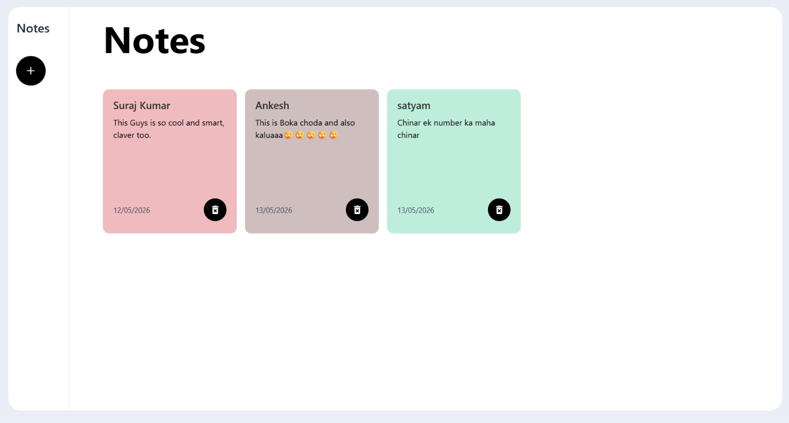

# 📝 Notes App

A modern and responsive Notes Application built using React.js and Tailwind CSS.  
This app allows users to create, store, and delete notes with a clean and minimal user interface.

---

# 🚀 Preview



---

# ✨ Features

- ➕ Create Notes
- 🗑️ Delete Notes
- 🎨 Random Color Notes
- 💾 Local Storage Support
- 📱 Fully Responsive Design
- 🔥 Modern UI with Tailwind CSS
- 📜 Scrollable Notes Section

---

# 🛠️ Tech Stack

- React.js
- Tailwind CSS
- JavaScript
- React Icons

---

# 📂 Project Structure

```bash
notes-app/
│
├── public/
├── src/
│   ├── assets/
│   ├── components/
│   ├── App.jsx
│   ├── main.jsx
│
├── package.json
├── README.md
└── .gitignore

⚙️ Installation & Setup

1️⃣ Clone Repository
git clone https://github.com/imsurajyd/notes-app.git

2️⃣ Go To Project Folder
cd notes-app

3️⃣ Install Dependencies
npm install

4️⃣ Run Development Server
npm run dev

📦 Build For Production
npm run build


# Future Improvements
✏️ Edit Notes
🔍 Search Notes
🌙 Dark Mode
📌 Pin Important Notes
🏷️ Categories & Tags
☁️ Cloud Storage

🙋‍♂️ Author
Suraj Kumar

GitHub: https://github.com/imsurajyd
# ⭐ Support

If you like this project, give it a ⭐ on GitHub.